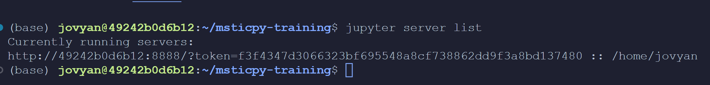

# MSTICPy Training Materials

This repo is holds training materials and tools used for demos for the
[MSTICPy Python Package](https://github.com/microsoft/msticpy).
Please refer to that site and the [MSTICPy documentation](https://msticpy.readthedocs.io/) on
ReadTheDocs.

# Docker Instructions

Install docker for desktop on Windows : 

Follow the instuctions at docker docs - https://docs.docker.com/desktop/install/windows-install/

Build Docker image locally:

`docker build -t msticpy-training -f .\.devcontainer\Dockerfile .`

Run docker image:

`docker run -p 8888:8888 msticpy-training`

Connect VSCode to Connector: [Attach to a Docker Container](https://code.visualstudio.com/docs/remote/attach-container)

To attach to a Docker container, either select ***Dev Containers: Attach to Running Container...*** from the Command Palette (F1) or use the ***Remote Explorer*** in the Activity Bar and from the ***Containers*** view, select the ***Attach to Container*** inline action on the container you want to connect to

Once you open a notebook in VSCode. You will see Select Kernel option on right hand top corner.

Once you click on it, you will be prompted to install Jupyter VSCode extension in container.

After you finished installation, you can then click Select Kernel and choose Connect to local Jupyter server.

Run Jupyter server URI from VSCode Terminal.

and then enter the URL on the next screen.

Finally, select a Remote Kernel.

## Contributing

This project welcomes contributions and suggestions.  Most contributions require you to agree to a
Contributor License Agreement (CLA) declaring that you have the right to, and actually do, grant us
the rights to use your contribution. For details, visit https://cla.opensource.microsoft.com.

When you submit a pull request, a CLA bot will automatically determine whether you need to provide
a CLA and decorate the PR appropriately (e.g., status check, comment). Simply follow the instructions
provided by the bot. You will only need to do this once across all repos using our CLA.

This project has adopted the [Microsoft Open Source Code of Conduct](https://opensource.microsoft.com/codeofconduct/).
For more information see the [Code of Conduct FAQ](https://opensource.microsoft.com/codeofconduct/faq/) or
contact [opencode@microsoft.com](mailto:opencode@microsoft.com) with any additional questions or comments.

## Trademarks

This project may contain trademarks or logos for projects, products, or services. Authorized use of Microsoft
trademarks or logos is subject to and must follow
[Microsoft's Trademark & Brand Guidelines](https://www.microsoft.com/en-us/legal/intellectualproperty/trademarks/usage/general).
Use of Microsoft trademarks or logos in modified versions of this project must not cause confusion or imply Microsoft sponsorship.
Any use of third-party trademarks or logos are subject to those third-party's policies.
