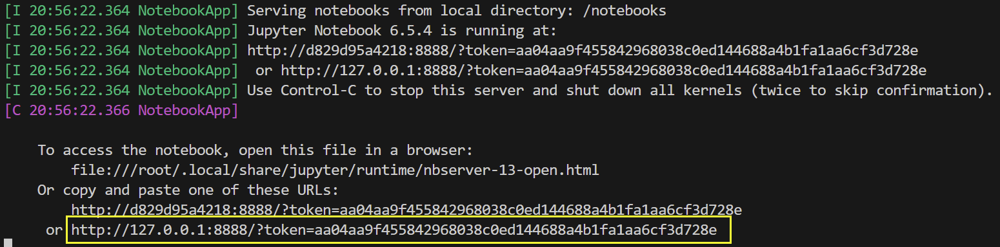
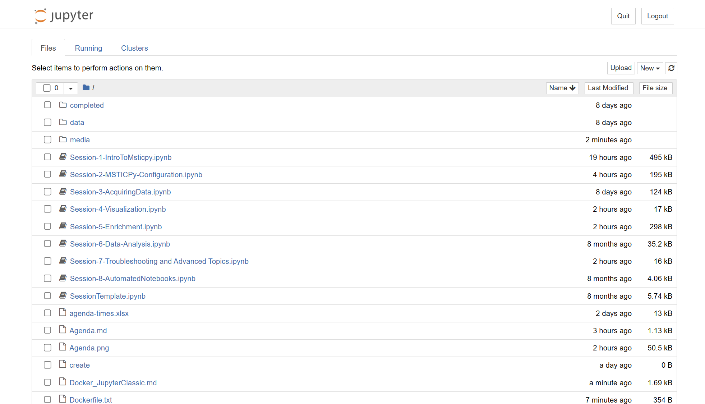

# Jupyter Classic docker setup

Using this docker container you can start a local Jupyter hub
and use your browser to connect to the Jupyter server running there.
The container has a mount point (`/notebooks`) that is connected
to the Jun2023 workshop folder on your local machine.
Changes that you make to the notebooks will be saved back to
the copies in your local clone of the `msticpy-training` repo

## Clone msticpy-training repo

Change directory to the folder (\<repos_folder\> in the example)
where you want to clone the [msticpy-training repo](https://github.com/microsoft/msticpy-training)

```bash
cd <repos_folder>
git clone https://github.com/microsoft/msticpy-training.git

```

## Build the docker image

```bash
cd msticpy-training/workshops/Jun2023
docker build --pull --rm -f "Dockerfile.txt" -t mptraining-jp/latest .
```

## Run the container

```bash
docker run -it -p 8888:8888 --rm -v .:/notebooks -w /notebooks -e MSTICPYCONFIG="/notebooks/msticpyconfig.yaml" mptraining-jp/latest bash
```


## Run Jupyter Server in the container

From the docker prompt

```bash
/opt/conda/bin/jupyter notebook --notebook-dir=/notebooks --ip='*' --port=8888 --no-browser --allow-root
```

## Copy localhost URL and Paste URL into your browser



## Jupyter home page

You should see this image

